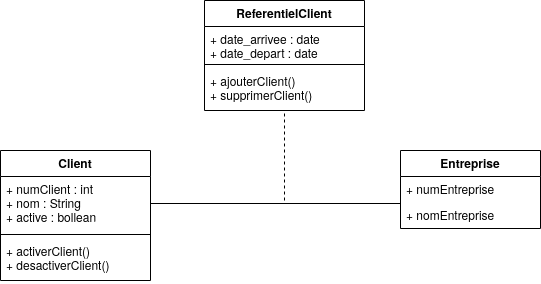
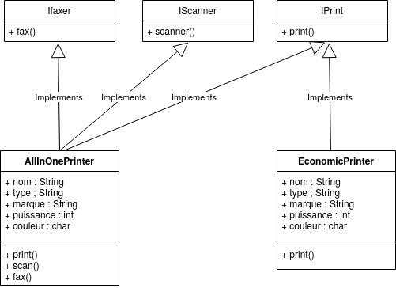
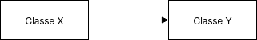
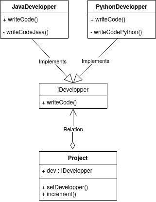

# Exercice SOLID

## Partie 1

1. Le principe de responsabilité unique stipule qu’une classe ne devrait avoir qu’une seule raison de changer et une seule responsabilité.
Dans cette classe ```Client``` il a deux responsabilités, les règles de gestion et la persistance
de la base de données. Ainsi, le principe de responsabilité unique n’est pas respecté.
2. Diagramme UML :


``` java
public class Client{

    public int numclient;
    public string nom;
    public bool active;


    public void activateCustomer(){
        active = true;
    }
    public void inactivateCustomer(){
        active = false;
    }
}


public class ReferentielClient{

    public void addCustomer(Customer customer){
        // code
    }
    public void deleteCustomer(Customer customer)
    {
        // code
    }
}
```

## Partie 2

1. Le principe de substitution de Liskov n’est pas respecté. La violation du LSP est la suivante :
   * La classe ```Rectangle``` représentant les propriétés d’un rectangle : longueur, largeur. On lui associe donc des **accesseurs** pour accéder et modifier la longueur et la largeur librement. On définit la règle "longueur" et "largeur" sont librement modifiable.
   * La classe ```Carré``` que l’on fait dériver de la classe Rectangle. On définit "cote".
**Problème** : Un carré ayant par définition quatre cotés égaux, il convient de restreindre la modification de la longueur et de la largeur pour qu’elles soient toujours égales.
Néanmoins, si un carré est utilisé là où, on s’attend à interagir avec un rectangle, des comportements incohérents peuvent subvenir : Les côtés d’un carré ne peuvent être changés indépendamment, contrairement à un rectangle.
Une mauvaise solution consisterait à modifier les setter du carré pour préserver l’invariance de ce dernier. Mais ceci violerait la règle des **setter** du rectangle qui spécifie que l’on puisse modifier longueur et largeur indépendamment.

2. La solution consiste à ne pas considérer un type Carré comme substitut d’un type ```Rectangle```, et les définir comme deux types complètement Independent. La classe ```Carré``` est un
représentant du concept "carré". La classe ```Rectangle``` est un représentant du concept "rectangle". Or, les représentants ne partagent pas les mêmes propriétés que ce qu’ils représentent. On les considère comme deux formes géométriques.

## Partie 3

1. La classe ```EconomicPrinter``` dépend de fonctionnalités dont elle n’a pas besoin : faxer et scanner. Le principe de séparation des interfaces n’est pas respecté.

2. Diagramme UMl :



## Partie 4

1. Diagramme UML :

2. On a une classe ```ClasseX``` qui constitue notre application. Cette classe utilise ```ClasseY``` venue de la bibiliothéque. Il existe donc une dépendance de ```ClasseX``` envers ```ClasseY```.
Si on souhaite remplacer ```ClasseY``` par ```ClasseZ``` qui implémente un autre algorithme de traitement des données, il ne sera pas facile ! L’application sera difficilement maintenable.
3. ```ClasseX``` a-t-elle besoin de savoir qu’elle travaille avec ```ClasseY``` ou n’importe qui d’autre? Pas vraiment, ce qui l’intéresse est qu’il existe des méthodes ```LireDonnees``` et ```TraitementDonnees``` avec une certaine signature. Peu m’importe qui va les implémenter et ce qu’il y a derrière. Ceci consiste à la définition d’une interface similaire à celle-ci :

``` java
interface IClasse{
    void LireDonnees();
    void TraitementDonnees();
}
```

```ClasseX``` ne dépend plus d’une implémentation particulière de ClasseY. C’est cette idée que l’on appelle principe d'inversion des dépendances.

## Partie 5

1. La classe ```Project``` peut être vue comme une classe de haut niveau alors que la classe ```JavaDevelopper``` est une classe de bas niveau : la classe de haut niveau a besoin de la classe de bas niveau pour fonctionner. Mais ici, la classe ```Project``` dépend directement des détails de la classe ```JavaDevelopper``` (de son implémentation). Le principe d’inversion des dépendances n’est pas respecté : la classe ```Project``` devrait dépendre d’une abstraction de la classe ```JavaDevelopper```.
Le principe **d’ouverture et fermeture** n’est pas pris en compte dans cet exemple. En effet, en ajoutant un nouveau langage de programmation on ne va pas modifier du code existant, on va ajouter une nouvelle classe qui n’existe pas ```PythonDevelopper``` encore et l’ajouter à la classe ```Projet```. Aucune méthode, signature ou type de propriété d’une classe ne va être modifiés.
2. Diagramme UML

