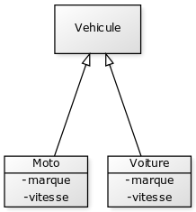
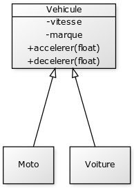

# Héritages

Il existe deux relations fondamentales en programmation objet :

* est un
Cette relation permet de créer une chaîne de relation d’identité entre des classes. Elle indique qu’une classe peut être assimilée à une autre classe qui correspond à une notion plus abstraite ou plus générale. On parle d’héritage pour désigner le mécanisme qui permet d’implémenter ce type de relation.

* a un
Cette relation permet de créer une relation de dépendance d’une classe envers une autre. Une classe a besoin des services d’une autre classe pour réaliser sa fonction. On parle également de relation de composition pour désigner ce type de relation.

Imaginons que nous voulions développer un simulateur de conduite. Nous pouvons concevoir une classe Voiture qui sera la représentation d’une voiture dans notre application.

``` java
public class Voiture {

  private final String marque;
  private float vitesse;

  public Voiture(String marque) {
    this.marque = marque;
  }

  // ...
}
```

Mais nous pouvons également rendre possible la simulation d’une moto. Dans ce cas, nous aurons également besoin d’une classe Moto.

``` java
public class Moto {

  private final String marque;
  private float vitesse;

  public Moto(String marque) {
    this.marque = marque;
  }

  // ...
}
```

On se rend vite compte qu’au stade de notre développement, une voiture et une moto représentent la même chose. Faut-il alors créer deux classes différentes ? En programmation objet, il n’y a pas de réponse toute faite à cette question. Mais si notre application gère, par exemple, le type de permis de conduire, il serait judicieux d’avoir des représentations différentes pour ces types de véhicule car ils nécessitent des permis de conduire différents. Si mon application de simulation permet de faire se déplacer des objets de ces classes, alors il va peut-être falloir autoriser les objets de type Voiture à aller en marche arrière mais pas les objets de type Moto.

Pour ce type de relations, nous pouvons utiliser l’héritage pour faire apparaître une classe réprésentant une notion plus générale ou plus abstraite. Dans notre exemple, il pourrait s’agir de la classe Vehicule. Les classes Voiture et Moto peuvent hériter de cette nouvelle classe puiqu’une voiture est un véhicule et une moto est un véhicule.



Le terme d’héritage vient du fait qu’une classe qui en étend une autre hérite de la définition de sa classe parente et notamment de ses attributs et de ses méthodes. Par exemple, les classes Voiture et Moto ont en commun la déclaration de l’attribut ```vitesse``` mais également les méthodes ```accelerer()``` et ```decelerer()```. Cet attribut semble donc faire partie de la généralisation commune de Vehicule.

``` java
public class Vehicule {

  private final String marque;
  private float vitesse;

  public Vehicule(String marque) {
    this.marque = marque;
  }

  public void accelerer(float deltaVitesse) {
    this.vitesse += deltaVitesse;
  }

  public void decelerer(float deltaVitesse) {
    this.vitesse = Math.max(this.vitesse - deltaVitesse, 0);
  }

  // ...

}
```

``` java
public class Voiture extends Vehicule {

  public Voiture(String marque) {
    super(marque);
  }

  // ...

}
```

``` java
public class Moto extends Vehicule {

  private final String marque;
  private float vitesse;

  public Moto(String marque) {
    this.marque = marque;
  }

  // ...

}
```



```super``` Le mot-clé super en java est utilisée pour faire appel aux méthodes ou constructeurs (avec ou sans paramètres) de la classe mère.
