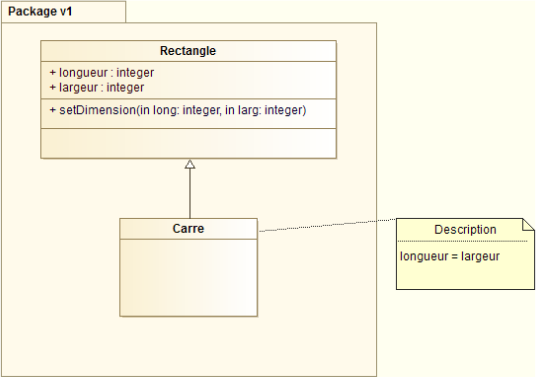
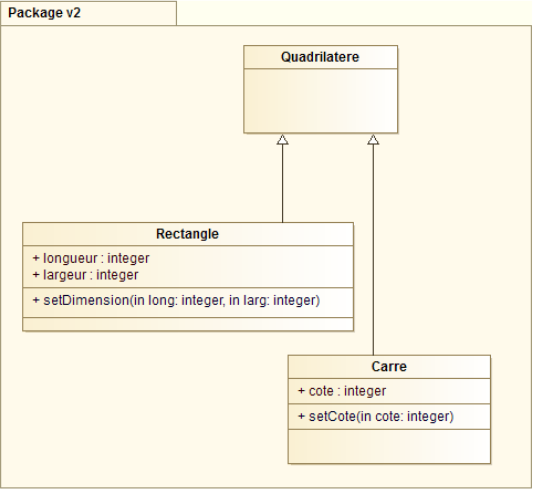

# Principe de substitution de Liskov

**Les sous classes doivent pouvoir être substituées à leur classe de base sans altérer le comportement de ses utilisateurs.**

Les méthodes qui utilisent des objets d'une classe doivent donc pouvoir utiliser "inconsciemment" des objets dérivés de cette classe : un utilisateur de la classe de base doit pouvoir continuer de fonctionner
correctement si une classe dérivée de la classe principale lui est fournie à la place.
Ce principe implique qu'une classe B qui hérite de A doive correspondre à une extension de la classe A.

## Exemple

Soit une classe Rectangle représentant les propriétés d'un rectangle : hauteur, largeur. On lui associe donc des accesseurs pour accéder et modifier la hauteur et la largeur librement. En postcondition, on
définit la règle : la hauteur et la largeur sont librement modifiables.
Soit une classe Carré que l'on fait dériver de la classe Rectangle. En effet, en mathématiques, un carré est un rectangle. Donc, on définit naturellement la classe Carré comme sous-type de la classe Rectangle. On
définit comme postcondition la règle : les quatre côtés du carré doivent être égaux.
Conceptuellement, un carré est un rectangle. Dans la terminologie orientée objet, nous dirons que le carré hérite du rectangle. Mais avec une telle modélisation, les méthodes
```setLargeur(largeur)``` et ```setLongueur(longueur)```
du rectangle ne peuvent pas être utilisées en l'état pour le carré .
Ainsi, soit nous redéfinissons les setters dans la classe carré, mais la postcondition des setter du rectangle qui spécifie que l'on puisse modifier hauteur et largeur indépendamment ne serait pas respectée, soit nous devons tester le type de l'objet avant d'utiliser la méthode, et ajouter une contrainte s'il s'agit d'un carré.



Pour respecter le principe de Liskov, nous ne ferons donc pas hériter le carré du rectangle : il s'agit de deux classes distinctes.


