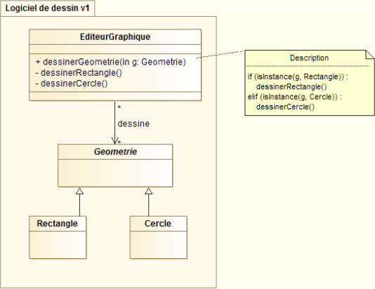
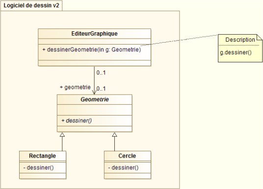

# Principe d'ouverture/fermeture

**Une classe doit être ouverte aux extensions mais fermées aux modifications.**

Il s'agit de permettre les modifications et ajouts de fonctionnalités sans avoir à modifier du code existant.

L'idée est qu'une fois qu'une classe a été approuvée via des revues de code, des tests unitaires et d'autres procédures de qualification, elle ne doit plus être modifiée mais seulement étendue. Le respect de
ce principe permet alors d'améliorer la flexibilité du code vis à vis des évolutions.
Le plus souvent, on commence par écrire le code le plus simple pouvant fonctionner, et, lorsque l'on rencontre une exception nous obligeant à modifier la classe pour l'étendre, on s'assure qu'une modification
ultérieure de même type ne nous forcera pas à modifier de nouveau notre design.

En pratique, le principe ouvert/fermé oblige à faire bon usage de l'abstraction et du polymorphisme. Les instanciations conditionnelles dans un constructeur sont de bons exemples de non respect de ce principe.
Une nouvelle implémentation aura pour impact l'ajout d'une condition dans la méthode.

Intéressons nous pour illustrer ce principe à un logiciel de dessin. Nous souhaitons pouvoir dessiner pour
commencer deux types de géométries : des cercles et des rectangles. Une première approche consisterai à faire porter par la classe **EditeurGraphique** une méthode générique de dessin testant le type de géométrie pour appeler les méthodes spécifiques de cette même classe.

## Exemple



Cette approche fonctionne, mais si nous voulons ajouter un nouveau type de géométrie (un hexagone par exemple), nous devrons ajouter une fonction
dessinerHexagone() dans la classe EditeurGraphique, et surtout, modifier le corps de la fonction principale de dessin pour tester un nouveau type de géométrie.

Une solution consiste à faire porter la méthode ```dessiner()```
par chacun des types de géométries. De cette manière, il n'est plus nécessaire de tester le type de géométrie dans la méthode principal de dessin : la méthode de dessin utilisée sera celle de la classe de l'objet dessiné.


