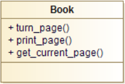

# Principe de responsabilité unique

**Une classe ne doit posséder qu'une et une seule raison de changer.**

Une classe ne doit donc posséder qu'une seule et unique responsabilité.
Ce principe permet de s'assurer que les classes n'offrent que des services fortement liés entre eux. Il permet :

* de diminuer la complexité du code
* de rendre une classe plus lisible
* d'améliorer l'encapsulation et la cohésion, les responsabilités étant regroupées (les éléments de la classe sont en relation les uns avec les autres : la classe est centrée sur un seul but).

La difficulté de mise en oeuvre de ce principe sera d'identifier les raisons de changer d'une classe. Cela passera souvent par l'identification des différents clients de la classe et de l'utilisation qu'ils en font. On peut également lister toutes les méthodes d'une classe et regrouper celles qui semblent être de la même famille : si plusieurs groupes apparaissent, cela peut indiquer que la classe doit être refactorer.

Si la classe a des dépendances externes (lecture / écriture dans des fichiers ou bases de données, utilisation d'API spécifiques, etc.) ce sont peut-être des responsabilités annexes qu'il faut déplacer.

## Exemple



Pour respecter le principe de responsabilité unique, les opérations qui ne sont pas exectuées par le livre lui-même sont déplacées dans des classes appropriées. C'est le cas de ```print_page()```. Mais
```get_current_page()``` et ```turn_page()``` sont bien effectués par le livre lui-même et restent dans la classe.


La raison pour laquelle il est important de garder une classe axée sur une seule préoccupation est que cela rend la classe plus robuste. En continuant avec l'exemple précédent, s'il y a un changement dans le
processus d'édition du livre, il y a un plus grand danger que le code d'impression se casse si elle fait partie de la même classe.
Il faut néanmoins garder à l'esprit qu'il ne faut pas aller trop loin dans la séparation des responsabilités, au risque de tomber dans un excès inverse et se retrouver avec une classe métier anémique.
