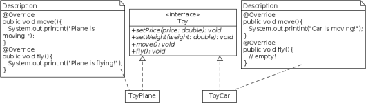
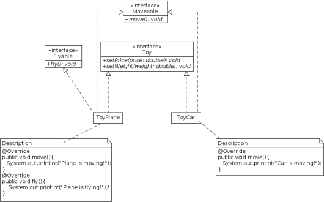

# Séparation des interfaces

**Plusieurs interfaces client spécifiques valent mieux qu'une seule interface générale. Les classes clients ne doivent pas être forcées de dépendre de services qu'elles n'utilisent pas.**

Le risque d'avoir une interface trop grande, trop complexe est que toute classe implémentant l'interface doit implémenter chacune de ses fonctions : on se retrouve alors très rapidement avec une confusion sur le rôle des sous-classes. De plus, si l'interface doit changer pour la classe A, cela va aussi impacter la classe B qui réalise la même interface mais n'utilise pas certaines de ses méthodes. Ce principe conduit à la création d'interfaces très spécifiques plutôt qu'à la réalisation de grosses interfaces générales ou de classes abstraites. Il en découle une réduction du couplage, les clients dépendant uniquement
des services qu'ils utilisent.

Prenons l'exemple d'une application qui construit différents types de jouets, chacun ayant un prix, un
poids. Certains jouets peuvent se déplacer, voire même voler. Toutes ces fonctionnalités sont définies dans
une interface Toy . La classe ToyCar , représentant une voiture réalise cette interface ainsi que la classe ToyPlane représentant un avion.

La classe ToyCar devra implémenter toutes les méthodes de l'interface, et donc aussi la méthode ```fly()``` dont elle n'a pas besoin, qui sera alors vide. Le principe de séparation des interfaces n'est pas respecté :
la capacité de voler n'a pas de sens pour ce type d'objet. De plus, cela entraîne également la violation du principe d'ouverture/fermeture. En effet, si on a besoin d'une nouvelle capacité pour un nouveau type
de jouet, par exemple sonner() pour un jouet téléphonique, il faudra modifier l'interface en ajoutant la nouvelle méthode, mais également toutes les classes qui réalisent déjà l'interface.

## Exemple



La solution est de déporter chacune des méthodes spécifiques à un type d'objet dans une interface dédiée. On obtient pour l'exemple deux nouvelles interfaces : Moveable et Flyable et on pourra faire en
sorte que les jouets réalisent uniquement les interfaces dont ils ont spécifiquement besoin.


