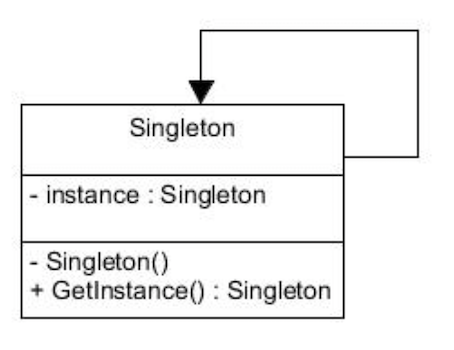

# Design Pattern - Singleton

Le singleton est un Design Pattern de création qui permet de garantir qu’il ne sera possible de créer **qu’une seule instance d’une classe donnée**. 

Exemple d’utilisation : 
* un objet représentant un composant matériel de l'ordinateur qui doit être restreint à une unique instanciation pour éviter des conflits de gestions des ressources du composant.
* Connexion à une base de donnée : faire en sorte que le programme se connecte toujours à la même base.
* Une classe d'interface

Ce singleton est très utilisé ! 

## Le diagramme UML



## Le singleton en java

Dans sa version minimale, le singleton s'écrit ainsi :

``` java

public final class Singleton {

    private static Singleton instance;

    private Singleton() {
    }

    public static Singleton getInstance() {
        if (instance == null) {
            instance = new Singleton();
        }
        return instance;
    }
}
``` 

## Exercice

[Exercice Composit](../Exercices/3.DesignPattern/composit/README.md)
