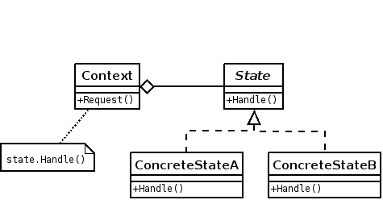

# Pattern State

## Problème

* un objet a un comportement dépendant de son état qui peut changer au cours du temps ;
* une opération contient de nombreuses conditions qui dépendent de l'état de l'objet.

## Description

* Le patron de conception "state' est utilisé pour modifier le comportement d'un objet lorsque son état
interne change. Tout se passera comme si l'objet changeait de classe.
* Le patron état propose deux classes principales :
  * la classe État, qui définit l'abstraction des comportements du patron
  * la classe Contexte, qui s'occupe de l'interfaçage du patron avec le reste de son contexte (l'application).
* La classe ```État``` permet via ses spécialisations de créer et gérer dynamiquement les comportements dont l'application aura besoin. La classe ```Contexte``` qui permet éventuellement à l'application de choisir le comportement à mettre en oeuvre et surtout d'orchestrer l'exécution des comportements. Il est à noter que la classe ```Contexte``` n'a pas l'exclusivité du choix de comportements. Il est en effet possible d'automatiser le changement d'état à la fin de l'exécution de l'état actif. La classe Contexte garde un lien vers une classe abstraite État. Chaque comportement est une spécialisation de cet État. Lorsque l'instance de la classe ```État``` change, le comportement de l'objet change. Ce patron permet donc à la classe ```Contexte``` de changer de comportement dynamiquement sans changer ni d'instance ni d'interface.



## Exemple

```java

public interface State {
   public void doAction(Context context);
}

public class ConcreteStateA implements State {
   public void doAction(Context context) {
      context.setState(this);	
   }
}

public class ConcreteStateB implements State {
   public void doAction(Context context) {
      context.setState(this);	
   }
}

////////////////////////////////////////////////////////

public class Context {
   private State state;

   public Context(){
      state = null;
   }

   public void setState(State state){
      this.state = state;		
   }

   public State getState(){
      return state;
   }
}

////////////////////////////////////////////////////////

public class App {
   public static void main(String[] args) {
      Context context = new Context();

      StartState startState = new ConcreteStateA();
      startState.doAction(context);

      StopState stopState = new ConcreteStateB();
      stopState.doAction(context);
   }
}


```

## Exercice

[Exercice state](../Exercices/3.DesignPattern/state/README.md)
