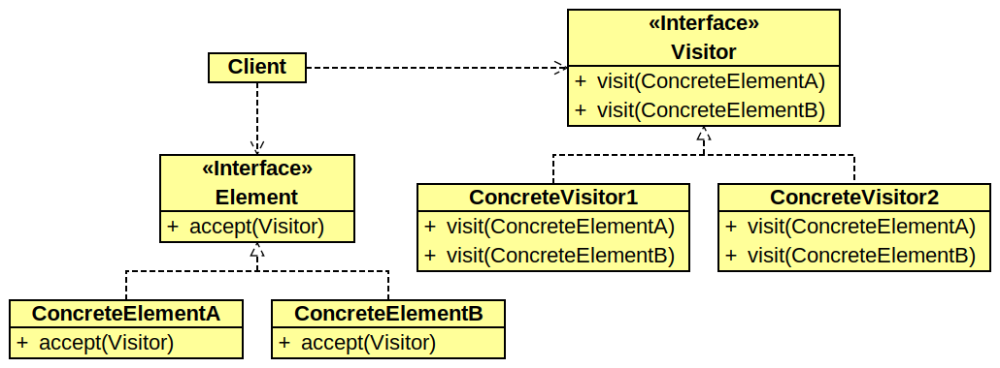

# Design Pattern - Visitor

Il s’agit d’un design pattern comportemental.

La problématique : on souhaite séparer les fonctions/algorithmes de la structure de données. On veut ainsi limiter tout couplage entre les données et leurs traitements, ce qui permet d’ajouter des traitements a nos structures de données sans avoir à les modifier. 

Modèle UML :

 

