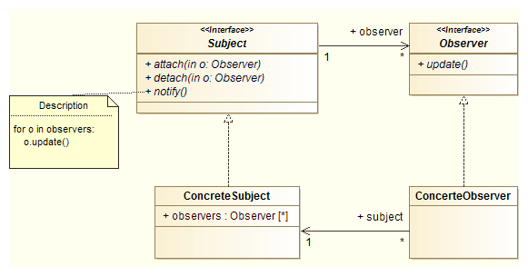

# Pattern Observer

Problème :

* Le changement d'état d'un objet impacte d'autres objets.
* Des notification sur le changement d'état d'un objet doivent être envoyées à d'autres objet inconnus.

Description :

Le patron de conception observateur/observable est utilisé en programmation pour envoyer un signal à des modules qui jouent le rôle d'observateur. En cas de notification, les observateurs executent alors l'action adéquate en fonction des informations qui parviennent depuis les modules qu'ils observent (les **observables**).
Par exemple, lorsqu'un élément est ajouté dans la corbeille d'un ordinateur, l'icône de la corbeille prend une nouvelle apparence. D'un point de vue programmation, la modification de cette icône est facile à envisager (l'événement d'ajout d'un élément provoque le modification de l'icône). Mais en fait, si des fenêtres sont ouvertes avec des liens vers la corbeille, chacune des icônes affichées à l'écran va être modifier.
La problème de programmation devient dès lors beaucoup plus complexe : à chaque ajout d'un élément dans la corbeille, il faudrait tester toute l'interface graphique pour détecter les icônes de la corbeille et
modifier leur apparence.



**Exemple :**
L'API Java propose la classe ```Observable``` ([doc](https://docs.oracle.com/javase/7/docs/api/java/util/Observable.html)) qui dispose de méthodes permettant notamment de prévenir les observateurs de cette classe de tout changement l'affectant, et l'interface ```Observer``` qui propose la méthode ```update()``` appelée dès que l'objet observé par l'observateur a été modifié.
On peut facilement modéliser l'interraction entre un interrupteur (objet observable) et une lampe (observateur) : lorsque l'on bascule l'interrupteur, l'état de la lampe change automatiquement (allumée /
éteinte) :

``` java
public class Switch extends Observable {
/* *
* Position de l ' interrupteur
*/
    public enum SWITCH_POSITION {
        ON,
        OFF
    }

    private SWITCH_POSITION position;

    public Switch () {
        this.position = SWITCH_POSITION.OFF ; // OFF par défaut
    }
/* *
* Méthode permettant de faire basculer l ' interrupteur
*/
    public void switchPosition () {
        if(this.position . equals ( SWITCH_POSITION.OFF ) ) {
            this.position = SWITCH_POSITION.ON ;
        }else{
            this.position = SWITCH_POSITION.OFF ;
        }
// Pour indiquer que l'interrupteur a été modifié :
// Marks this Observable object as having been changed ; the hasChanged
// method will now return true.
        this.setChanged () ;
// Pour notifier les observateurs de la classe ( la lampe ) du changement d'état
/*
* If this object has changed , as indicated by the hasChanged method ,
* then notify all of its observers and then call the clearChanged
* method to indicate that this object has no longer changed .
*/
        this.notifyObservers () ;
    }

    public SWITCH_POSITION getPosition () {
        return position ;
    }
}
        
public class Light implements Observer {
/* *
* Etat de la lampe : allum é e ou é teinte
*/
    public enum LIGHT_MODE {
        ON,
        OFF;
    }

    private LIGHT_MODE mode;

    public Light ( Switch lightSwitch ) {
        this.mode = LIGHT_MODE.OFF; // éteinte par d é faut
        lightSwitch.addObserver(this); // ajout de this ( la lampe ) comme   observateur de l ' interrupteur
    }
/* *
* This method is called whenever the observed object is changed .
* An application calls an Observable object 's notifyObservers method to
have all the object 's observers notified of the change .
* observableObject : the observable object .
* arg : an argument possibly passed to the notifyObservers method .
*/
    @Override
    public void update(Observable observableObject, Object arg) {
    // TODO Auto - generated method stub
    // On r é cupere l 'é tat de l ' interrupteur
        SWITCH_POSITION posS = ((Switch) observableObject).getPosition ();
        if (posS.equals(SWITCH_POSITION . OFF )) {
            this.mode = LIGHT_MODE.OFF;
        }else {
            this.mode = LIGHT_MODE.ON;
        }
        System.out.println("Lumiere : " + this.mode);
    }
}


...
Switch sw = new Switch() ;
Light l = new Light(sw) ;
sw.switchPosition() ;
sw.switchPosition() ;
```

Affiche :
Lumiere : ON
Lumiere : OFF
