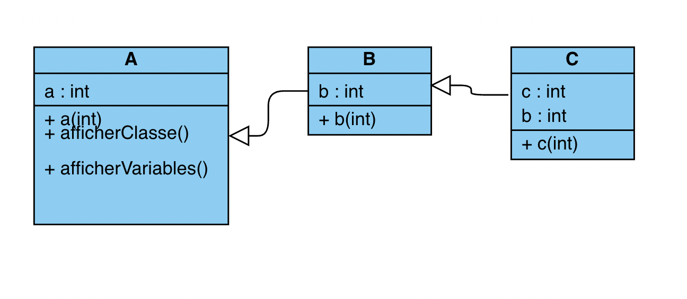

# Exercice sur le polymorphisme

* créer les classes correspondant au diagramme suivant :

Note : on redéfinit l'attribut "b" dans la classe C.

* surcharger les fonctions afficherClasse() et afficherVariables() dans les classes B et C en les adaptants aux classes en questions.

* les constructeurs de C et B doivent également modifier les valeurs "a", "b" et "c" a partir de la valeur donnée en paramètre. 

* Dans le main, construire un tableau de différentes lettres (A, B, C). Puis boucler sur leur classe et leur variable.

* Jouer sur les différentes possibilitées de constructeur (appel du constructeur parent notamment), ou encore sur des valeurs par défaut de a, b et c.

* essayez de prédire l'affichage que doit donner l'exécution de la méthode main() dans la classe Alphabet. Une attention particulière devra être portée sur le polymorphisme utilisé dans la hierarchie des classes A, B et C, qui démontre une situation de "shadowing" entre B.b et C.b.

