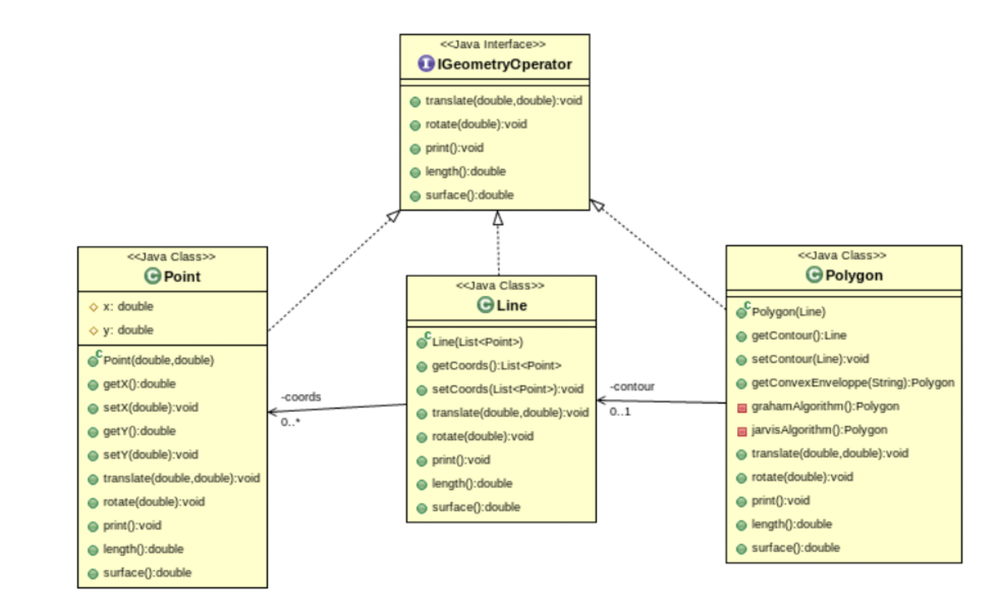

# Exercice Récapitulatif

On modélise très simplement une API géospatiale dont l’implémentation est modélisée ci-dessous :



Une modélisation simple de ce modèle de données ici :

[Enoncé exercice](./Exo_visitor_ennonce)

## Visitor

* Créer une classe ```Visitor``` abstraite qui permet de visiter les différentes géométries
* La classe ```Geometry``` ne contiendra plus qu'une fonction ```accept()``` du visitor abstrait.
* créer les différents visitor (translate, print et rotate)

## Composite

Nous voulons ajouter à ces éléments géométrique une nouvelle géométrie qui serait une collection de géométrie. Nous appelons ce nouvel objet GeometryCollection. **Ajouter ce nouvel objet à partir du pattern Composite**.

## Strategy

On trouve que la méthode de calcul de l'enveloppe convexe du polygone n'est pas top... Surtout, l'ajout de nouveaux algorithmes de calcul va alourdir la classe ```Polygon```. Nous voudrions également que cette classe ne dépende pas de tous les algorithmes de calcul convexe.

De plus, on voudrait rendre plus générique le calcul d'enveloppe convexe via le calcul sur un ensemble de points.

On se propose de refactorer cela via un pattern strategy. **Réalisez ce refactoring**.

* créer une classe abstraite stratégie (convexhullstrategie) qui ne contient qu'une fonction execute(). Cette fonction permettra le calcul de l'enveloppe.
* créer ensuite les différentes classes concréte en fonction des 2 algorithmes (Jarvis et Graham).
* enfin, modifier la classe ```Polygon``` pour qu'elle puisse prendre en compte ces calculs (cette classe ne voit que la classe abstraite).

## factory simple

On décide de déléguer la création des objets héritant de Geometry à une fabrique.

Cette **fabrique simple** devra contenir les fonctions suivantes :

```Java
Point createPoint(double x, double y);
Line createLine(ArrayList <Point> points);
Polygon createPolygon(ArrayList<Line> contour);
GeometryCollection createGeometryCollection(ArrayList<Geometry> geometries);
```

On pourra ajouter des constructeurs particuliers : un polygone a partir d'une seule line :

```java
Polygon createPolygon(Line contour);
```

**Réaliser cette fabrique**.

## Singleton

Puisque nous n'avons besoin que d'une seule fabrique, nous décidons de rendre faire de la classe factory un singleton. **Réaliser ce refactoring**.
