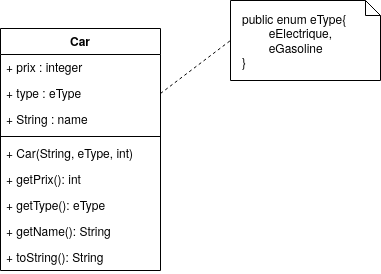

# Exercice - Recap 2

## Decorator

A partir d'une classe ```Car``` mis a disposition dans une bibliothèque (Pour les besoins de l'exercice il faudra créer cette classe), nous allons enrichir ses fonctionnalitées à l'aide du pattern decorator.

* Créer la classe ```Car``` comme défini dans ce diagramme UML :



* Implémentez le pattern decorator et implémentez 2 classes ```CarWithGPS``` et ```CarWithSunRoof```. Ces 2 classes doivent étendre une classe ```CarWithOption```.

L’appel à la méthode ```toString()``` héritée de ```Car``` sur un objet de type ```CarWithGPS``` par exemple doit afficher le résultat de l’appel à ```toString()``` sur l’objet ```Car``` encapsulé dans le décorateur concaténé « OPTION : GPS (500 euros) », où 500 euros est ici un exemple de prix pour l’option GPS. Les surcoût de chaque option est défini au sein de chaque classe par une variable constante static.

* Testez votre application en créant :
  * Une voiture de base
  * Une Voiture avec l'option GPS.
  * Une Voiture avec l'option Toit ouvrant
  * Une Voiture avec toutes les options
  * Pour chaque voiture créé appelez la méthode ```toString()``` afin de contrôler le bon fonctionnement.

## Fabrique

L'obectif est de créer une fabrique abstraite qui va permettre de créer des véhicules dans leurs versions essence ou éléctrique.

