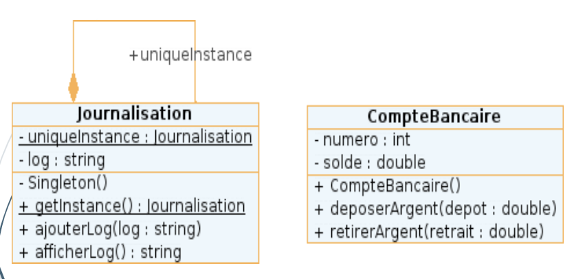

# Exercice Singleton

Cet exercice met en lumière un exemple classique du **singleton**, la concaténation des logs et leur affichage.

Prenons l'exemple d'un compte bancaire sur lequel nous pouvons déposer ou retirer de l'argent. Nous allons créer une classe CompteBancaire qui permettra de faire ces opérations, ainsi que de stocker le solde disponible sur le compte. 

Nous souhaitons afficher les opérations (effectuées ou refusées) dans la console. En imaginant qu'il soit possible de faire d'autres opérations bancaire, nous désirons que toutes utilisent le même outil de journalisation.  Pour cela, nous allons implémenter une classe distincte nommée Journalisation reprenant le pattern Singleton. Ainsi nous allons garantir que notre programme va utiliser une seule et même instance de la classe Journalisation. 

Remarque : la banque n'autorise pas les découverts.

Le diagramme UML en question :

 

