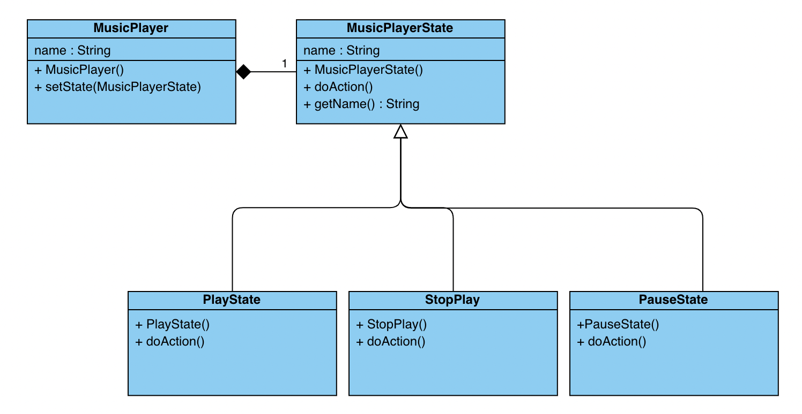

# Exercice State

* Ecrivez un programme pour la gestion des états d'un baladeur MP3 en utilisant le pattern state en suivant la modélisation ci-dessous.



* Ajouter une variable membre de type integer à la classe ```MusicPlayer``` qui permettra de gérér l'index de la liste de lecture.
* Ajouter les getter et setter sur ce nouvel attriubut.
* Ajouter 2 nouveaux états ```NextState``` et ```PreviousState``` qui permettent de gérer l'avancement de la lecture.
* Testez les différents états de votre application
